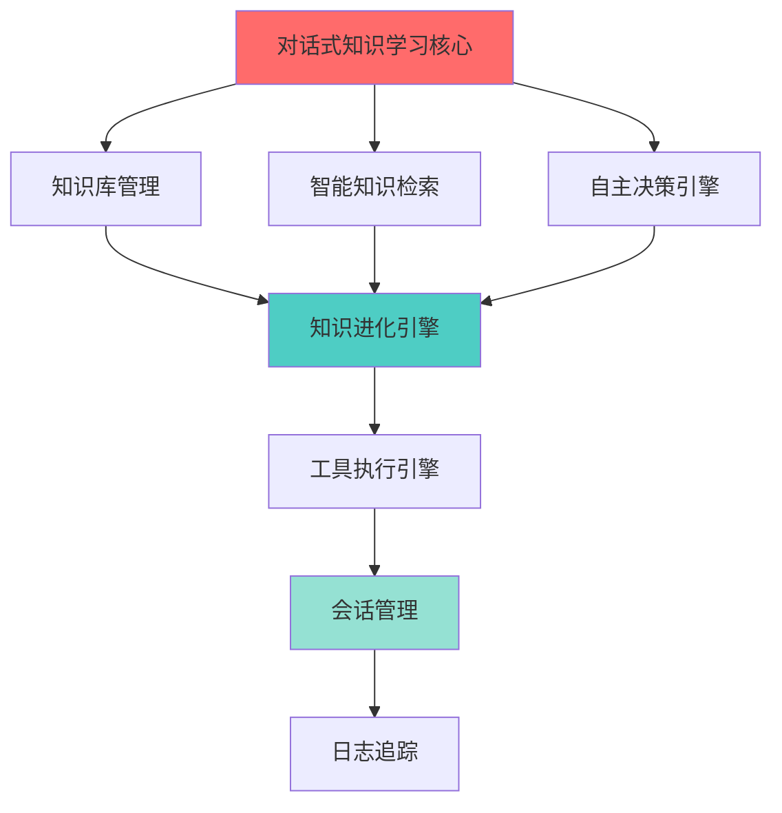

# AutonoMind 产品需求文档 (PRD)

## 1. 文档信息

| 字段 | 内容 |
|------|------|
| **文档名称** | AutonoMind 产品需求文档 |
| **版本** | v1.0 |
| **创建日期** | 2026-03-02 |
| **作者** | Product Manager |
| **状态** | 草稿 |

---

## 2. 目录

1. [文档信息](#2-文档信息)
2. [项目概述](#3-项目概述)
3. [目标用户](#4-目标用户)
4. [核心功能](#5-核心功能)
5. [非功能需求](#6-非功能需求)
6. [用户体验设计](#7-用户体验设计)
7. [产品路线图](#8-产品路线图)
8. [验收标准](#9-验收标准)
9. [附录](#10-附录)

---

## 3. 项目概述

### 3.1 产品定位

AutonoMind 是一个具备**自主决策**、**自我进化**能力的 AI Agent 架构平台。它能够直接使用大语言模型(LLM),根据用户问题自主检索知识库,智能决策是继续检索还是使用工具执行任务,并能够自主维护和更新向量知识库。

### 3.2 核心价值主张

- **自主性**: Agent 无需人工干预即可完成复杂任务链
- **智能化**: 基于 LLM 的强推理能力,实现智能检索和决策
- **进化性**: 从交互中学习,自动发现和更新知识
- **可扩展性**: 灵活集成多种 LLM、向量数据库和工具
- **可观测性**: 完整的执行过程追踪和可视化

### 3.3 目标市场

- **企业客户**: 需要智能客服、知识管理的企业
- **开发者**: 需要 AI Agent 能力的开发者
- **科研机构**: 需要 AI 研究平台的机构
- **个人用户**: 需要 AI 助手的个人用户

### 3.4 竞争优势

| 竞品 | AutonoMind 优势 |
|------|----------------|
| LangChain | 自主知识进化能力 |
| AutoGPT | 更好的可观测性和可控性 |
| ChatDev | 专注知识管理场景 |
| 自研方案 | 开源、可定制、低成本 |

---

## 4. 目标用户

### 4.1 用户画像

#### 用户画像 1: 企业知识管理员

| 属性 | 描述 |
|------|------|
| **姓名** | 李明 |
| **职位** | 企业知识管理专员 |
| **行业** | 制造业/金融/医疗 |
| **痛点** | 知识分散、更新不及时、难以维护 |
| **需求** | 集中管理知识、自动更新、智能检索 |
| **技术能力** | 中等 |

#### 用户画像 2: AI 应用开发者

| 属性 | 描述 |
|------|------|
| **姓名** | 王芳 |
| **职位** | AI 应用开发工程师 |
| **行业** | 互联网/SaaS |
| **痛点** | LLM 集成复杂、缺乏通用框架 |
| **需求** | 快速集成、插件化、易扩展 |
| **技术能力** | 高 |

#### 用户画像 3: 个人用户

| 属性 | 描述 |
|------|------|
| **姓名** | 张伟 |
| **职业** | 自由职业者/学生 |
| **痛点** | 信息过载、知识难以积累 |
| **需求** | 智能助手、知识整理、自动学习 |
| **技术能力** | 低-中 |

### 4.2 典型使用场景

#### 场景 1: 企业智能客服

**背景**: 某企业需要搭建智能客服系统,能够基于企业知识库自动回答客户问题。

**流程**:
1. 管理员上传产品手册、FAQ 文档到知识库
2. 客户提出问题,Agent 检索相关知识
3. Agent 生成回答,并记录对话
4. Agent 从新对话中学习,自动更新知识库

**价值**: 减少人工客服工作量,提升服务效率,知识自动积累。

#### 场景 2: 开发者构建 AI 应用

**背景**: 开发者需要快速构建一个具备知识检索能力的 AI 应用。

**流程**:
1. 开发者调用 API 创建 Agent 实例
2. 配置 LLM、向量数据库、工具
3. 上传领域知识文档
4. Agent 自动处理用户请求

**价值**: 降低开发门槛,快速上线,灵活定制。

#### 场景 3: 个人知识助手

**背景**: 个人用户需要一个智能助手,帮助整理和学习知识。

**流程**:
1. 用户上传学习资料、笔记
2. 向助手提问,获取知识检索答案
3. 助手自动发现知识关联,推荐相关内容
4. 用户反馈后,助手优化知识组织

**价值**: 提升学习效率,知识自动整理,个性化推荐。

---

## 5. 核心功能

### 5.1 功能优先级 (MoSCoW)

| 优先级 | 功能模块 |
|--------|----------|
| **Must have** | 智能检索、自主决策、知识管理、基础 API |
| **Should have** | 知识进化、工具执行、会话管理、日志追踪 |
| **Could have** | Web UI、多租户支持、高级分析 |
| **Won't have** (V1) | 多模态支持、联邦学习、分布式部署 |

---

### 5.2 功能模块详解

#### 功能 1: 智能知识检索

**描述**: 基于用户查询,在向量知识库中检索相关知识,支持多轮迭代检索。

**用户故事**:

| 用户故事 | 验收标准 | 优先级 |
|---------|---------|--------|
| 作为用户,我想要向 Agent 提问,系统能检索相关知识 | • 检索准确率 > 85%<br>• 响应时间 < 2s<br>• 返回 Top 10 相关知识 | Must have |
| 作为用户,我想要系统能理解复杂问题,分步骤检索 | • 支持多轮检索<br>• 每轮检索时间 < 500ms<br>• 检索结果相关度递增 | Should have |
| 作为用户,我想要检索结果包含相关度评分和来源 | • 返回相似度分数<br>• 显示知识来源<br>• 支持按分数/来源排序 | Should have |

**验收标准**:
- [ ] 支持文本、URL、文件多种输入方式
- [ ] 检索准确率(Precision@10) > 85%
- [ ] 平均检索响应时间 < 2s
- [ ] 支持语义检索 + 关键词检索混合
- [ ] 支持元数据过滤(按来源、时间、标签等)

---

#### 功能 2: 自主决策引擎

**描述**: 基于 LLM,自主决策是继续检索知识、使用工具执行,还是完成任务。

**用户故事**:

| 用户故事 | 验收标准 | 优先级 |
|---------|---------|--------|
| 作为 Agent,我想要根据当前知识评估是否足够 | • 准确判断知识充足度<br>• 决策响应时间 < 1s<br>• 提供决策理由 | Must have |
| 作为 Agent,我想要选择合适的工具执行任务 | • 工具选择准确率 > 80%<br>• 工具参数自动生成<br>• 执行结果评估 | Should have |
| 作为 Agent,我想要知道何时完成任务 | • 任务完成识别准确率 > 90%<br>• 支持手动终止<br>• 提供完成总结 | Should have |

**验收标准**:
- [ ] 决策准确率 > 85%
- [ ] 决策响应时间 < 1s
- [ ] 支持决策日志和可解释性
- [ ] 支持手动干预和覆盖决策
- [ ] 支持自定义决策策略

---

#### 功能 3: 对话式知识学习(核心)

**描述**: Agent 能够在对话过程中持续学习和积累知识,用户可以通过直接对话来教导和更新知识库,无需手动上传文档或编辑知识条目。这是 AutonoMind 最核心的能力。

**用户故事**:

| 用户故事 | 验收标准 | 优先级 |
|---------|---------|--------|
| 作为用户,我想要通过对话让 Agent 学习新知识 | • Agent 能够识别用户提供的知识点<br>• 自动提取并结构化知识<br>• 学习成功后确认反馈 | **Must have** |
| 作为用户,我想要纠正 Agent 的错误回答 | • Agent 能够识别纠正意图<br>• 自动更新相关知识<br>• 更新后知识立即生效 | **Must have** |
| 作为用户,我想要补充不完整的信息 | • Agent 能够识别补充信息<br>• 自动关联到现有知识<br>• 标记知识为"已增强" | **Must have** |
| 作为用户,我想要查看对话中学到的知识 | • 显示本次对话新增的知识<br>• 显示更新过的知识<br>• 支持跳转到知识详情 | Should have |
| 作为用户,我想要批准/拒绝自动学习的知识 | • 实时显示待审核的知识<br>• 支持一键批准/拒绝<br>• 批准后立即生效 | Should have |
| 作为用户,我想要回滚知识更新 | • 支持单个知识回滚<br>• 支持批量回滚<br>• 显示回滚前后对比 | Could have |

**验收标准**:
- [ ] 对话中学习新知识的准确率 > 75%
- [ ] 纠正错误后知识更新延迟 < 5s
- [ ] 支持识别至少 5 种学习意图(新增、纠正、补充、删除、合并)
- [ ] 自动学习的知识需要人工审核的可配置
- [ ] 审核流程可完全关闭(直接生效)
- [ ] 提供知识学习统计(学习次数、准确率、更新频率)

---

#### 功能 3.1: 知识库管理

**描述**: 用户可以手动或自动添加、删除、更新知识条目,支持批量导入和导出。

**用户故事**:

| 用户故事 | 验收标准 | 优先级 |
|---------|---------|--------|
| 作为用户,我想要上传文档到知识库 | • 支持 PDF、TXT、Markdown<br>• 自动提取和向量化<br>• 上传进度显示 | Should have |
| 作为用户,我想要手动添加和编辑知识 | • 提供表单/JSON 接口<br>• 实时验证格式<br>• 编辑历史记录 | Should have |
| 作为用户,我想要删除过期或错误的知识 | • 支持单个/批量删除<br>• 删除确认提示<br>• 回收站功能(可选) | Could have |
| 作为管理员,我想要监控知识库状态 | • 显示知识条目总数<br>• 分类统计<br>• 存储使用情况 | Could have |

**验收标准**:
- [ ] 支持 PDF、TXT、Markdown、CSV 格式
- [ ] 单次上传最大 100MB
- [ ] 向量化处理时间 < 1s/页
- [ ] 支持批量操作(最多 100 条)
- [ ] 提供知识库统计仪表盘

---

#### 功能 3.2: 知识进化引擎

**描述**: Agent 从交互中自动发现新知识,识别冲突,自主更新知识库。

**用户故事**:

| 用户故事 | 验收标准 | 优先级 |
|---------|---------|--------|
| 作为 Agent,我想要从对话中学习新知识 | • 自动提取有价值信息<br>• 准确率 > 70%<br>• 人工审核机制 | Should have |
| 作为 Agent,我想要识别知识冲突 | • 冲突检测准确率 > 80%<br>• 列出冲突双方<br>• 推荐解决方案 | Should have |
| 作为用户,我想要审核和批准知识更新 | • 显示待审核的知识<br>• 支持批量批准/拒绝<br>• 审核历史记录 | Should have |

**验收标准**:
- [ ] 新知识提取准确率 > 70%
- [ ] 冲突检测准确率 > 80%
- [ ] 支持人工审核机制
- [ ] 支持知识版本控制
- [ ] 提供知识变更历史

---

#### 功能 4: 工具执行引擎

**描述**: Agent 可以调用预定义的工具(如 API、数据库查询、文件操作)完成任务。

**用户故事**:

| 用户故事 | 验收标准 | 优先级 |
|---------|---------|--------|
| 作为用户,我想要注册自定义工具 | • 提供工具定义接口<br>• 支持多种参数类型<br>• 自动生成文档 | Should have |
| 作为 Agent,我想要安全地执行工具 | • 沙箱环境<br>• 超时控制<br>• 错误处理和重试 | Should have |
| 作为用户,我想要监控工具执行情况 | • 执行日志<br>• 成功率统计<br>• 性能指标 | Could have |

**验收标准**:
- [ ] 支持至少 10 种内置工具
- [ ] 支持自定义工具注册
- [ ] 工具执行超时 < 30s
- [ ] 工具调用成功率 > 95%
- [ ] 提供工具执行监控

---

#### 功能 5: 会话管理

**描述**: 管理用户与 Agent 的对话会话,支持多轮对话和历史查询。

**用户故事**:

| 用户故事 | 验收标准 | 优先级 |
|---------|---------|--------|
| 作为用户,我想要创建新会话 | • 自动分配会话 ID<br>• 记录开始时间<br>• 支持会话命名 | Must have |
| 作为用户,我想要查看历史对话 | • 按时间排序<br>• 支持分页<br>• 支持搜索 | Should have |
| 作为管理员,我想要分析会话数据 | • 会话统计<br>• 对话趋势<br>• 热门问题 | Could have |

**验收标准**:
- [ ] 支持无限制对话轮次
- [ ] 会话上下文保留时间 > 24h
- [ ] 历史查询响应时间 < 500ms
- [ ] 支持会话导出
- [ ] 提供会话统计分析

---

#### 功能 6: 日志追踪

**描述**: 完整记录 Agent 的执行过程,包括检索、决策、执行各步骤,便于调试和优化。

**用户故事**:

| 用户故事 | 验收标准 | 优先级 |
|---------|---------|--------|
| 作为开发者,我想要查看 Agent 执行流程 | • 可视化流程图<br>• 每步详细信息<br>• 时间统计 | Should have |
| 作为管理员,我想要监控系统性能 | • QPS、响应时间<br>• 错误率<br>• 资源使用率 | Should have |

**验收标准**:
- [ ] 记录所有 Agent 决策
- [ ] 记录所有工具调用
- [ ] 记录所有知识检索
- [ ] 支持日志查询和过滤
- [ ] 支持日志导出

---

#### 功能 7: Web 管理界面

**描述**: 提供可视化的 Web 界面,方便用户管理知识库、查看会话、监控系统。

**用户故事**:

| 用户故事 | 验收标准 | 优先级 |
|---------|---------|--------|
| 作为用户,我想要通过浏览器访问系统 | • 响应式设计<br>• 支持 Chrome、Safari<br>• 加载时间 < 3s | Could have |
| 作为用户,我想要直观的管理知识库 | • 知识列表视图<br>• 上传/删除/编辑操作<br>• 搜索和过滤 | Could have |
| 作为用户,我想要查看会话历史 | • 对话列表<br>• 对话详情<br>• 导出功能 | Could have |

**验收标准**:
- [ ] 支持现代浏览器(Chrome 90+, Safari 14+)
- [ ] 页面加载时间 < 3s
- [ ] 支持 1000+ 条知识展示
- [ ] 支持暗色模式
- [ ] 支持中英文双语

---

### 5.3 功能依赖关系

```
对话式知识学习(核心)
    ↙  ↓  ↘
知识库管理  智能知识检索  自主决策引擎
    ↓         ↓           ↓
  └──────→ 知识进化引擎 ←──────┘
             ↓
        工具执行引擎
             ↓
           会话管理
             ↓
           日志追踪

知识进化引擎
    ↘
会话管理 → 知识发现
```

---

## 6. 非功能需求

### 6.1 性能需求

| 指标 | 目标值 | 说明 |
|------|--------|------|
| **API 响应时间(P95)** | < 2s | 端到端响应时间 |
| **知识检索时间** | < 500ms | 单次向量检索 |
| **LLM 调用时间** | < 5s | OpenAI API 调用 |
| **工具执行时间** | < 30s | 单个工具执行 |
| **系统吞吐量** | > 100 QPS | 并发请求处理能力 |
| **并发会话数** | > 10,000 | 同时在线会话 |

### 6.2 可靠性需求

| 指标 | 目标值 | 说明 |
|------|--------|------|
| **系统可用性** | > 99.9% | 月度停机时间 < 43min |
| **数据持久化** | 100% | 数据不丢失 |
| **故障恢复时间** | < 5min | 故障后自动恢复 |
| **数据备份频率** | 每日 | 全量备份 + 实时增量 |

### 6.3 安全性需求

| 指标 | 目标值 | 说明 |
|------|--------|------|
| **传输加密** | TLS 1.3 | HTTPS 通信 |
| **存储加密** | AES-256 | 敏感数据加密 |
| **认证方式** | JWT + API Key | 支持多种认证 |
| **授权模型** | RBAC | 基于角色的访问控制 |
| **API 限流** | 100 req/min/IP | 防止滥用 |

### 6.4 可扩展性需求

| 指标 | 目标值 | 说明 |
|------|--------|------|
| **水平扩展** | 支持 | 无状态服务 |
| **数据库分片** | 支持 | 向量数据库分片 |
| **知识库容量** | > 100 万条 | 支持大规模知识 |
| **多 LLM 支持** | 5+ | OpenAI、Anthropic、DeepSeek 等 |

### 6.5 可用性需求

| 指标 | 目标值 | 说明 |
|------|--------|------|
| **界面易用性** | SUS > 75 | 系统可用性量表 |
| **操作步骤** | ≤ 3 步 | 完成核心任务 |
| **错误提示** | 清晰明确 | 包含解决建议 |
| **文档完整性** | 100% | 所有功能有文档 |

### 6.6 兼容性需求

| 类型 | 要求 |
|------|------|
| **浏览器** | Chrome 90+, Safari 14+, Firefox 88+, Edge 90+ |
| **操作系统** | Linux, macOS, Windows (Server) |
| **Python 版本** | 3.9+ |
| **数据库** | PostgreSQL 14+, Qdrant 1.7+ |

---

## 7. 用户体验设计

### 7.1 用户旅程

```
用户注册/登录
    ↓
创建 Agent 实例
    ↓
上传知识文档
    ↓
配置 LLM 和工具
    ↓
与 Agent 对话
    ↓
查看执行日志
    ↓
优化知识库
```

### 7.2 交互流程

#### 智能检索流程

```
用户输入问题
    ↓
Agent 向量化查询
    ↓
检索向量知识库
    ↓
返回相关知识
    ↓
LLM 生成回答
    ↓
展示给用户
```

#### 自主决策流程

```
Agent 接收用户请求
    ↓
检索知识
    ↓
LLM 评估知识充足度
    ↓
决策: 继续检索 / 执行工具 / 完成
    ↓
执行决策
    ↓
记录决策日志
```

### 7.3 界面设计要点

#### 知识库管理界面
- 左侧: 知识分类树
- 中间: 知识列表(支持搜索、过滤)
- 右侧: 知识详情编辑

#### 会话界面
- 上方: 对话历史
- 下方: 输入框
- 右侧: Agent 执行过程(可折叠)

#### 监控仪表盘
- 关键指标卡片(QPS、响应时间、错误率)
- 实时图表(请求趋势、知识库增长)
- 日志列表

### 7.4 错误处理

| 错误类型 | 提示信息 | 处理方式 |
|---------|---------|----------|
| **认证失败** | "用户名或密码错误" | 重新登录 |
| **知识检索失败** | "未找到相关知识" | 尝试其他查询 |
| **LLM 调用失败** | "服务暂时不可用,请稍后重试" | 自动重试 3 次 |
| **工具执行超时** | "任务执行超时" | 终止并提示 |
| **网络错误** | "网络连接失败,请检查网络" | 显示重试按钮 |

---

## 8. 产品路线图

### 8.1 V1.0 (2026 Q2 - MVP)

**目标**: 核心功能可用,验证产品价值

**功能列表**:
- [x] 智能知识检索
- [x] 自主决策引擎(基础)
- [x] **对话式知识学习**(核心)
- [x] 知识库管理(基础)
- [x] 会话管理
- [x] 基础 API

**非功能目标**:
- API 响应时间 < 3s
- 系统可用性 > 99%
- 支持单机部署

---

### 8.2 V1.5 (2026 Q3)

**目标**: 增强自动化能力,提升用户体验

**新增功能**:
- [ ] **对话式知识学习增强**(准确率 > 80%)
- [ ] 知识进化引擎(基础)
- [ ] 工具执行引擎(内置工具)
- [ ] 日志追踪
- [ ] Web 管理界面(beta)

**优化项**:
- [ ] 检索准确率提升至 > 90%
- [ ] API 响应时间 < 2s
- [ ] 支持多种 LLM

---

### 8.3 V2.0 (2026 Q4)

**目标**: 企业级功能,生产可用

**新增功能**:
- [ ] 多租户支持
- [ ] 知识进化引擎(完整)
- [ ] 高级工具(自定义工具)
- [ ] Web 管理界面(正式版)

**优化项**:
- [ ] 系统可用性 > 99.9%
- [ ] 支持分布式部署
- [ ] 完善的监控告警

---

### 8.4 V2.5 (2027 Q1)

**目标**: 增强分析和协作能力

**新增功能**:
- [ ] 高级分析仪表盘
- [ ] 知识图谱可视化
- [ ] 团队协作功能
- [ ] 多模态支持(图片、音频)

**优化项**:
- [ ] 性能优化(响应时间 < 1s)
- [ ] 用户体验优化

---

### 8.5 V3.0 (2027 Q2+)

**目标**: 开放生态,构建平台

**新增功能**:
- [ ] 插件市场
- [ ] Agent 市场(预置 Agent 模板)
- [ ] API SDK(多语言)
- [ ] 联邦学习(可选)

**优化项**:
- [ ] 完整的文档和教程
- [ ] 社区建设

---

## 5.3 功能依赖关系



**依赖说明**:
- **对话式知识学习**: 所有功能的基础,必须最先实现
- **知识进化引擎**: 依赖对话式学习、检索和决策的输出
- **会话管理**: 依赖工具执行的结果,提供用户交互界面
- **日志追踪**: 横切关注点,贯穿所有模块

**开发顺序**:
1. Sprint 1: 对话式学习 + 知识库管理 + 智能检索
2. Sprint 2: 自主决策 + 知识进化引擎
3. Sprint 3: 工具执行 + 会话管理 + 日志追踪

---

## 5.4 功能成功指标

| 功能模块 | 成功指标 | 衡量方式 | 目标值 |
|---------|---------|---------|--------|
| **对话式知识学习** | 学习准确率 | 人工审核通过率 | > 75% |
| | 知识更新延迟 | 从纠错到生效时间 | < 5s |
| | 用户满意度 | 问卷评分(1-5) | > 4.0 |
| **智能知识检索** | 检索准确率 | Precision@10 | > 85% |
| | 检索响应时间 | P95延迟 | < 2s |
| | 召回率 | 相关知识覆盖率 | > 80% |
| **自主决策引擎** | 决策准确率 | 与人工决策一致性 | > 85% |
| | 决策响应时间 | 单次决策耗时 | < 1s |
| | 任务完成率 | 用户任务成功率 | > 90% |
| **知识库管理** | 处理成功率 | 文档上传成功率 | > 95% |
| | 向量化准确率 | 与原文语义一致性 | > 90% |
| **工具执行引擎** | 执行成功率 | 工具调用成功率 | > 95% |
| | 平均执行时间 | P95执行耗时 | < 30s |
| | 超时率 | 超过30s的比例 | < 5% |
| **会话管理** | 会话稳定性 | 异常中断率 | < 1% |
| | 历史查询速度 | 获取历史耗时 | < 500ms |

---

## 5.5 异常场景处理

### 5.5.1 对话式学习异常

| 异常场景 | 触发条件 | 处理方式 | 用户体验 |
|---------|---------|---------|---------|
| 学习意图识别失败 | 用户输入含糊不清 | 询问用户确认意图 | "您是想添加新知识还是纠正现有知识?" |
| 知识提取失败 | LLM 无法结构化信息 | 返回原始文本供人工编辑 | "我理解到以下内容,请帮助结构化:" |
| 知识冲突 | 新知识与已有知识矛盾 | 标记为冲突,待审核 | "检测到可能冲突的知识,已提交审核" |
| 知识库写入失败 | 数据库/向量库异常 | 重试3次,失败后通知管理员 | "知识保存失败,请稍后重试" |

### 5.5.2 检索异常

| 异常场景 | 触发条件 | 处理方式 | 用户体验 |
|---------|---------|---------|---------|
| 无相关知识 | 相似度低于阈值 | 提示用户换个说法或联系管理员 | "未找到相关知识,建议换个提问方式" |
| 向量库连接失败 | Qdrant服务不可用 | 降级为关键词检索 | "智能检索暂时不可用,使用基础检索" |
| 检索超时 | 单次检索>5s | 返回缓存结果或降级处理 | "检索超时,返回部分结果" |
| 结果质量低 | Top1相似度<0.6 | 自动扩展检索范围 | "正在扩大检索范围..." |

### 5.5.3 决策异常

| 异常场景 | 触发条件 | 处理方式 | 用户体验 |
|---------|---------|---------|---------|
| LLM调用失败 | API限流或服务不可用 | 重试+降级为规则决策 | "AI决策暂时不可用,使用基础策略" |
| 决策陷入循环 | 连续3次相同决策 | 强制切换决策类型 | "正在尝试其他方法..." |
| 工具参数生成失败 | LLM无法生成有效参数 | 使用默认参数或人工输入 | "请提供必要参数:" |
| 决策超时 | 单次决策>10s | 选择默认决策(继续检索) | "决策超时,将继续检索" |

### 5.5.4 系统异常

| 异常场景 | 触发条件 | 处理方式 | 用户体验 |
|---------|---------|---------|---------|
| 并发会话超限 | 单用户会话>100 | 关闭最早的非活跃会话 | "会话数已达上限,已自动关闭旧会话" |
| 存储空间不足 | MinIO使用>95% | 拒绝新上传,提示清理 | "存储空间不足,请清理旧文档" |
| API限流 | 单IP>100 req/min | 返回429,提示降低频率 | "请求过于频繁,请稍后再试" |
| 数据库连接失败 | PostgreSQL不可用 | 降级为内存缓存 | "数据库连接失败,服务降级中" |

---

## 5.6 优先级评估依据

### MoSCoW 法则应用

**Must have (必须有)**: MVP 核心功能,缺失则无法验证产品价值
- 对话式知识学习(新增/纠正/补充)
- 基础知识检索
- 简单的自主决策(检索/生成)
- 用户和会话管理
- 基础 API

**Should have (应该有)**: 显著提升用户体验和系统可用性
- 高级检索(过滤/重排序)
- 知识进化引擎
- 工具执行(内置工具)
- 日志追踪和可视化
- 知识审核机制

**Could have (可以有)**: 锦上添花,有则更好
- Web 管理界面
- 高级工具(自定义工具)
- 数据分析和报表
- 多租户支持
- 知识图谱可视化

**Won't have (V1不会有)**: 后续版本考虑
- 多模态支持(图片/音频)
- 联邦学习
- 分布式部署
- 移动端 App

### RICE 评分示例

| 功能 | Reach | Impact | Effort | Confidence | RICE分数 |
|------|-------|--------|--------|------------|---------|
| 对话式学习 | 1000用户 | 9(巨大) | 40人日 | 80% | **1800** |
| 智能检索 | 1000用户 | 8(大) | 15人日 | 90% | **4800** |
| 知识进化 | 500用户 | 7(大) | 30人日 | 60% | **700** |
| Web UI | 2000用户 | 5(中) | 25人日 | 90% | **360** |

**结论**: 智能检索优先级最高,其次是对话式学习。

---

## 9. 验收标准

### 9.1 功能验收

| 模块 | 验收标准 |
|------|----------|
| **智能知识检索** | 检索准确率 > 85%,响应时间 < 2s |
| **自主决策引擎** | 决策准确率 > 85%,支持至少 3 种决策类型 |
| **知识库管理** | 支持 4 种文件格式,单次上传 < 100MB |
| **知识进化引擎** | 新知识提取准确率 > 70%,冲突检测准确率 > 80% |
| **工具执行引擎** | 支持 10+ 内置工具,执行成功率 > 95% |
| **会话管理** | 支持无限制对话轮次,历史查询 < 500ms |
| **日志追踪** | 记录所有关键操作,支持查询和导出 |

### 9.2 性能验收

- [ ] API 响应时间(P95) < 2s
- [ ] 知识检索时间 < 500ms
- [ ] LLM 调用时间 < 5s
- [ ] 系统吞吐量 > 100 QPS
- [ ] 并发会话数 > 10,000

### 9.3 质量验收

- [ ] 单元测试覆盖率 > 80%
- [ ] 集成测试通过率 100%
- [ ] 无 Critical 和 High 级别 Bug
- [ ] 代码审查通过
- [ ] 文档完整

### 9.4 安全验收

- [ ] 通过安全扫描
- [ ] 无已知高危漏洞
- [ ] 数据加密和访问控制正确实施
- [ ] 敏感数据脱敏

---

## 10. 附录

### 10.1 相关文档

- [系统架构设计](../architecture/系统架构设计.md)
- [技术选型决策(ADR)](../adr/)
- [API 接口文档](../api/API接口文档.md)
- [数据模型设计](../数据模型设计.md)
- [用户故事](./用户故事.md)

### 10.2 术语表

| 术语 | 说明 |
|------|------|
| **Agent** | 自主决策的智能体 |
| **LLM** | 大语言模型 |
| **Vector DB** | 向量数据库 |
| **Knowledge Base** | 知识库 |
| **Retriever** | 知识检索器 |
| **Decision Engine** | 决策引擎 |
| **Tool** | 工具(可执行的功能) |
| **Evolution** | 知识进化 |

### 10.3 参考资料

- OpenAI API 文档
- LangChain 文档
- Qdrant 文档
- FastAPI 文档

---

**文档版本**: v1.0
**最后更新**: 2026-03-02
