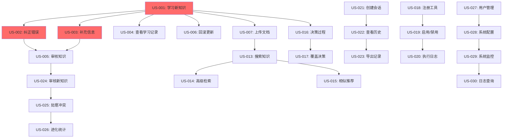

# AutonoMind 用户故事

## 1. 文档信息

| 字段 | 内容 |
|------|------|
| **文档名称** | AutonoMind 用户故事 |
| **版本** | v1.0 |
| **创建日期** | 2026-03-02 |
| **作者** | Product Manager |

---

## 2. 目录

1. [概述](#3-概述)
2. [对话式知识学习模块(核心)](#4-对话式知识学习模块核心)
3. [知识管理模块](#5-知识管理模块)
4. [智能检索模块](#6-智能检索模块)
5. [自主决策模块](#7-自主决策模块)
6. [工具执行模块](#8-工具执行模块)
7. [会话管理模块](#9-会话管理模块)
8. [知识进化模块](#10-知识进化模块)
9. [系统管理模块](#11-系统管理模块)

---

## 3. 概述

本文档包含 AutonoMind 项目的所有用户故事,按模块组织。每个用户故事包含:

- 用户故事描述
- 验收标准(Acceptance Criteria)
- 故事点估算(Story Points)
- 优先级

---

## 4. 对话式知识学习模块(核心)

### US-001: 对话中学习新知识

**用户故事**:

```
作为用户,
我希望通过对话让 Agent 学习新知识,
这样我就不需要手动上传文档或编辑知识条目,直接用对话就能让 Agent 获得新知识。
```

**验收标准**:

- [ ] Agent 能够识别用户的"学习"意图(如:"记住这个...")
- [ ] 自动从用户输入中提取关键信息
- [ ] 将提取的信息结构化为知识条目
- [ ] 学习成功后明确告知用户
- [ ] 显示学到的知识内容供确认
- [ ] 支持用户进一步补充或修正
- [ ] 学习的知识自动添加到知识库
- [ ] 支持实时生效(下次查询即可使用)

**故事点**: 8

**优先级**: Must have

---

### US-002: 对话中纠正错误

**用户故事**:

```
作为用户,
我希望能够纠正 Agent 的错误回答,
这样 Agent 能够自我提升,下次回答更准确。
```

**验收标准**:

- [ ] Agent 识别用户的纠正意图(如:"不对,应该是...")
- [ ] 定位到错误的原始知识
- [ ] 自动更新相关知识条目
- [ ] 更新后知识立即生效
- [ ] 告知用户已更正并更新知识库
- [ ] 记录纠正历史
- [ ] 支持撤销纠正操作
- [ ] 纠正后自动学习(避免重复错误)

**故事点**: 8

**优先级**: Must have

---

### US-003: 对话中补充信息

**用户故事**:

```
作为用户,
我希望能够补充 Agent 回答中不完整的信息,
这样知识库能更全面,后续回答更完整。
```

**验收标准**:

- [ ] Agent 识别用户的补充意图(如:"补充一点...")
- [ ] 自动关联到现有相关知识
- [ ] 将补充内容合并到知识中
- [ ] 标记知识为"已增强"
- [ ] 更新后知识立即生效
- [ ] 显示更新前后的对比
- [ ] 支持用户确认是否合并
- [ ] 记录补充历史

**故事点**: 5

**优先级**: Must have

---

### US-004: 查看对话中学到的知识

**用户故事**:

```
作为用户,
我希望能够查看本次对话中学到的所有知识,
这样我就能了解 Agent 的学习进度和内容。
```

**验收标准**:

- [ ] 在对话界面显示"本次学到 X 条新知识"
- [ ] 点击展开显示学到的知识列表
- [ ] 显示每条知识的来源(学习时间、触发问题)
- [ ] 支持点击跳转到知识详情页
- [ ] 显示知识状态(待审核/已生效)
- [ ] 支持批量编辑学到的知识
- [ ] 支持删除学到的知识
- [ ] 支持导出学习记录

**故事点**: 5

**优先级**: Should have

---

### US-005: 审核自动学习的知识

**用户故事**:

```
作为知识管理员,
我希望能够审核 Agent 自动学习的知识,
这样我就能保证知识库的质量和准确性。
```

**验收标准**:

- [ ] 显示待审核的知识列表
- [ ] 显示知识内容、来源、学习时间
- [ ] 显示相似已有知识用于对比
- [ ] 支持单个批准/拒绝
- [ ] 支持批量批准/拒绝
- [ ] 批准后知识立即生效
- [ ] 拒绝后记录原因
- [ ] 审核操作记录日志
- [ ] 支持设置审核策略(全部审核/抽样审核/直接生效)

**故事点**: 8

**优先级**: Should have

---

### US-006: 回滚知识更新

**用户故事**:

```
作为用户,
我希望能够回滚对话中的知识更新,
这样我就能撤销错误的学习或纠正操作。
```

**验收标准**:

- [ ] 显示对话中的知识更新历史
- [ ] 支持单个知识回滚
- [ ] 支持批量回滚整个对话的更新
- [ ] 显示回滚前后的对比
- [ ] 回滚后知识恢复到之前版本
- [ ] 记录回滚操作
- [ ] 支持撤销回滚
- [ ] 设置回滚时间窗口(默认 24 小时)

**故事点**: 5

**优先级**: Could have

---

## 5. 知识管理模块

### US-007: 上传文档到知识库

**用户故事**:

```
作为企业知识管理员,
我希望上传 PDF/TXT/Markdown 文档到知识库,
这样我就能将公司文档集中管理,无需手动录入每条知识。
```

**验收标准**:

- [ ] 支持上传 PDF、TXT、Markdown 格式文档
- [ ] 单个文件大小限制 100MB
- [ ] 支持批量上传(最多 10 个文件)
- [ ] 上传后自动提取文本内容
- [ ] 显示上传进度和预计处理时间
- [ ] 处理完成后通知用户(邮件/Webhook)
- [ ] 文档元数据可编辑(标题、分类、标签)
- [ ] 上传失败时显示错误原因

**故事点**: 5

**优先级**: Must have

---

### US-008: 手动添加知识条目

**用户故事**:

```
作为知识管理员,
我希望能够手动添加单条知识条目,
这样我就能快速补充遗漏的重要信息。
```

**验收标准**:

- [ ] 提供表单输入知识内容
- [ ] 支持设置知识来源(manual/document/evolution)
- [ ] 支持添加元数据(分类、标签、备注)
- [ ] 实时验证知识内容格式
- [ ] 添加成功后显示知识 ID
- [ ] 支持 Markdown 格式编辑
- [ ] 预览功能
- [ ] 支持批量添加(最多 50 条)

**故事点**: 3

**优先级**: Must have

---

### US-009: 编辑和更新知识

**用户故事**:

```
作为知识管理员,
我希望能够编辑已有知识条目,
这样我就能修正错误或更新过时信息。
```

**验收标准**:

- [ ] 支持编辑知识内容
- [ ] 支持编辑元数据
- [ ] 编辑时显示原始内容和当前版本号
- [ ] 保存后版本号自动递增
- [ ] 支持查看历史版本(最多 10 个版本)
- [ ] 支持回滚到历史版本
- [ ] 编辑冲突提示(多人同时编辑)
- [ ] 编辑日志记录(操作人、时间、变更内容)

**故事点**: 5

**优先级**: Should have

---

### US-010: 删除知识条目

**用户故事**:

```
作为知识管理员,
我希望能够删除错误或过时的知识条目,
这样知识库就能保持清洁和准确。
```

**验收标准**:

- [ ] 支持单个删除
- [ ] 支持批量删除(最多 100 条)
- [ ] 删除前二次确认
- [ ] 显示删除影响(关联会话数)
- [ ] 软删除(标记为 archived,实际保留 30 天)
- [ ] 支持恢复已删除知识
- [ ] 删除操作记录日志
- [ ] 关联向量数据同步删除

**故事点**: 3

**优先级**: Should have

---

### US-011: 导出知识库

**用户故事**:

```
作为知识管理员,
我希望能够导出知识库数据,
这样我就能备份或迁移知识到其他系统。
```

**验收标准**:

- [ ] 支持导出为 JSON 格式
- [ ] 支持导出为 CSV 格式
- [ ] 支持按分类/来源/时间范围筛选导出
- [ ] 支持导出元数据(来源、标签、版本)
- [ ] 大数据量导出支持分批下载
- [ ] 导出文件命名包含时间戳
- [ ] 导出任务支持后台执行
- [ ] 导出完成后发送下载链接

**故事点**: 5

**优先级**: Could have

---

### US-012: 知识分类和标签管理

**用户故事**:

```
作为知识管理员,
我希望能够创建和管理知识分类和标签,
这样我就能更好地组织知识库。
```

**验收标准**:

- [ ] 支持创建分类(最多 3 级层级)
- [ ] 支持创建标签(支持颜色标识)
- [ ] 知识条目可关联多个标签
- [ ] 支持按分类浏览知识
- [ ] 支持按标签筛选知识
- [ ] 分类和标签支持拖拽排序
- [ ] 统计每个分类/标签的知识数量
- [ ] 支持合并和删除分类/标签

**故事点**: 5

**优先级**: Could have

---

## 5. 智能检索模块

### US-013: 搜索知识库

**用户故事**:

```
作为用户,
我希望能够在知识库中搜索相关知识,
这样我就能快速找到需要的信息。
```

**验收标准**:

- [ ] 支持自然语言查询
- [ ] 返回 Top 10 相关知识(可配置)
- [ ] 显示相关度评分(0-100)
- [ ] 显示知识来源和时间戳
- [ ] 搜索响应时间 < 2s
- [ ] 支持按相关度/时间排序
- [ ] 高亮显示匹配的关键词
- [ ] 支持搜索建议和纠错

**故事点**: 5

**优先级**: Must have

---

### US-014: 高级检索功能

**用户故事**:

```
作为高级用户,
我希望能够使用高级检索功能,
这样我就能更精确地找到所需知识。
```

**验收标准**:

- [ ] 支持按来源筛选(manual/document/evolution)
- [ ] 支持按分类筛选
- [ ] 支持按标签筛选(多选)
- [ ] 支持时间范围筛选
- [ ] 支持语义检索 + 关键词检索混合
- [ ] 支持保存搜索条件
- [ ] 支持导出搜索结果
- [ ] 搜索历史记录

**故事点**: 8

**优先级**: Should have

---

### US-015: 相似知识推荐

**用户故事**:

```
作为用户,
我希望查看知识时能看到相似知识推荐,
这样我就能发现更多相关信息。
```

**验收标准**:

- [ ] 在知识详情页显示相似知识(5 条)
- [ ] 相似度 > 70% 的才推荐
- [ ] 点击相似知识直接跳转
- [ ] 推荐算法可配置(相关度阈值)
- [ ] 推荐结果缓存(1 分钟)
- [ ] 支持隐藏推荐功能
- [ ] 推荐原因说明(共享关键词、相似度等)

**故事点**: 3

**优先级**: Could have

---

## 6. 自主决策模块

### US-016: 查看决策过程

**用户故事**:

```
作为开发者,
我希望能够查看 Agent 的决策过程,
这样我就能理解 Agent 的工作原理和优化效果。
```

**验收标准**:

- [ ] 显示决策类型(retrieve/execute/complete)
- [ ] 显示决策理由(自然语言描述)
- [ ] 显示决策依据(检索到的知识、上下文等)
- [ ] 显示决策时间
- [ ] 支持时间线视图展示完整流程
- [ ] 支持导出决策日志
- [ ] 决策日志可搜索和过滤
- [ ] 关键节点可标记为重要

**故事点**: 5

**优先级**: Should have

---

### US-017: 覆盖 Agent 决策

**用户故事**:

```
作为高级用户,
我希望能够覆盖 Agent 的决策,
这样我就能在必要时人工干预。
```

**验收标准**:

- [ ] 在决策阶段提供人工干预按钮
- [ ] 支持选择继续检索、执行工具、完成任务
- [ ] 人工决策记录日志
- [ ] 人工决策后 Agent 继续执行
- [ ] 支持设置决策覆盖策略(总是询问/从不询问)
- [ ] 人工决策后重新生成后续计划
- [ ] 提供撤销人工决策功能

**故事点**: 8

**优先级**: Could have

---

## 7. 工具执行模块

### US-018: 注册自定义工具

**用户故事**:

```
作为开发者,
我希望能够注册自定义工具,
这样我就能让 Agent 调用我自己的功能。
```

**验收标准**:

- [ ] 提供工具定义表单(名称、描述、参数)
- [ ] 支持参数类型定义(string/integer/boolean/array/object)
- [ ] 支持参数必填/可选设置
- [ ] 支持上传工具函数(Python 代码)
- [ ] 自动验证工具代码语法
- [ ] 工具注册后自动生成文档
- [ ] 支持工具测试(模拟调用)
- [ ] 工具可设置为内置或自定义

**故事点**: 8

**优先级**: Should have

---

### US-019: 启用/禁用工具

**用户故事**:

```
作为管理员,
我希望能够启用或禁用工具,
这样我就能控制 Agent 可以使用的功能。
```

**验收标准**:

- [ ] 工具列表显示启用状态
- [ ] 支持一键启用/禁用工具
- [ ] 批量启用/禁用工具
- [ ] 禁用后 Agent 无法调用该工具
- [ ] 禁用操作记录日志
- [ ] 内置工具默认启用,自定义工具默认禁用
- [ ] 工具权限与用户角色关联

**故事点**: 3

**优先级**: Must have

---

### US-020: 查看工具执行日志

**用户故事**:

```
作为开发者,
我希望能够查看工具执行日志,
这样我就能排查问题和监控性能。
```

**验收标准**:

- [ ] 显示工具名称和执行时间
- [ ] 显示输入参数和输出结果
- [ ] 显示执行状态(成功/失败/超时)
- [ ] 显示错误信息(如果失败)
- [ ] 支持按时间/工具/状态筛选
- [ ] 支持导出执行日志
- [ ] 统计工具调用次数和成功率
- [ ] 执行时间超过阈值告警

**故事点**: 5

**优先级**: Should have

---

## 8. 会话管理模块

### US-021: 创建 Agent 会话

**用户故事**:

```
作为用户,
我希望能够创建新的 Agent 会话,
这样我就能开始与 Agent 对话。
```

**验收标准**:

- [ ] 提供创建会话按钮
- [ ] 会话自动分配唯一 ID
- [ ] 会话记录创建时间
- [ ] 支持设置会话名称
- [ ] 支持选择 LLM 模型(如果配置了多个)
- [ ] 支持设置温度参数
- [ ] 会话创建后进入对话界面
- [ ] 会话列表显示最新会话

**故事点**: 3

**优先级**: Must have

---

### US-022: 查看会话历史

**用户故事**:

```
作为用户,
我希望能够查看历史会话,
这样我就能找到之前的对话记录。
```

**验收标准**:

- [ ] 会话列表按时间倒序排列
- [ ] 显示会话名称、创建时间、消息数
- [ ] 支持搜索会话(按名称/内容)
- [ ] 支持分页加载(每页 20 条)
- [ ] 点击会话进入对话详情
- [ ] 支持删除会话(二次确认)
- [ ] 支持归档会话
- [ ] 统计总会话数和活跃会话数

**故事点**: 5

**优先级**: Must have

---

### US-023: 导出对话记录

**用户故事**:

```
作为用户,
我希望能够导出对话记录,
这样我就能保存或分享对话内容。
```

**验收标准**:

- [ ] 支持导出为 TXT 格式
- [ ] 支持导出为 JSON 格式
- [ ] 支持导出为 Markdown 格式
- [ ] 导出内容包括用户消息和 Agent 回复
- [ ] 可选择是否包含检索到的知识
- [ ] 可选择是否包含执行日志
- [ ] 导出文件命名包含会话名称和时间
- [ ] 大对话记录导出支持分批下载

**故事点**: 5

**优先级**: Could have

---

## 9. 知识进化模块

### US-024: 审核新知识

**用户故事**:

```
作为知识管理员,
我希望能够审核 Agent 自动发现的新知识,
这样我就能确保知识库的质量。
```

**验收标准**:

- [ ] 显示待审核知识列表
- [ ] 显示新知识内容、来源、发现时间
- [ ] 显示相似已有知识(用于对比)
- [ ] 支持批准/拒绝操作
- [ ] 批准后知识自动添加到知识库
- [ ] 拒绝后记录拒绝原因
- [ ] 支持批量操作(全部批准/全部拒绝)
- [ ] 审核操作记录日志

**故事点**: 5

**优先级**: Should have

---

### US-025: 处理知识冲突

**用户故事**:

```
作为知识管理员,
我希望能够处理知识冲突,
这样我就能解决知识库中的矛盾。
```

**验收标准**:

- [ ] 显示冲突列表(冲突类型、时间)
- [ ] 显示冲突双方的知识内容
- [ ] Agent 自动推荐解决方案(保留哪个/合并)
- [ ] 支持手动选择保留哪条知识
- [ ] 支持合并知识(手动编辑后保存)
- [ ] 支持标记为无冲突
- [ ] 冲突解决后更新版本号
- [ ] 冲突处理记录日志

**故事点**: 8

**优先级**: Should have

---

### US-026: 查看知识进化统计

**用户故事**:

```
作为管理员,
我希望能够查看知识进化统计,
这样我就能了解 Agent 的学习效果。
```

**验收标准**:

- [ ] 显示总知识数量
- [ ] 显示手动添加知识数
- [ ] 显示文档提取知识数
- [ ] 显示进化发现知识数
- [ ] 显示冲突数量和解决数量
- [ ] 显示知识增长趋势图(按日/周/月)
- [ ] 显示知识来源分布饼图
- [ ] 显示知识版本分布

**故事点**: 5

**优先级**: Could have

---

## 10. 系统管理模块

### US-027: 用户管理

**用户故事**:

```
作为管理员,
我希望能够管理系统用户,
这样我就能控制谁能访问系统。
```

**验收标准**:

- [ ] 支持创建用户(用户名、邮箱、密码)
- [ ] 支持分配角色(admin/user)
- [ ] 支持禁用/启用用户
- [ ] 支持重置用户密码
- [ ] 支持查看用户登录历史
- [ ] 支持为用户生成 API Key
- [ ] 支持删除用户(二次确认)
- [ ] 用户列表支持搜索和筛选

**故事点**: 5

**优先级**: Must have

---

### US-028: 系统配置

**用户故事**:

```
作为管理员,
我希望能够配置系统参数,
这样我就能根据需求调整系统行为。
```

**验收标准**:

- [ ] 支持配置默认 LLM 模型
- [ ] 支持配置温度参数
- [ ] 支持配置最大 token 数
- [ ] 支持配置知识检索数量(默认 Top K)
- [ ] 支持配置文件上传大小限制
- [ ] 支持配置速率限制
- [ ] 配置修改后即时生效
- [ ] 配置修改记录日志

**故事点**: 3

**优先级**: Should have

---

### US-029: 系统监控

**用户故事**:

```
作为管理员,
我希望能够监控系统运行状态,
这样我就能及时发现和解决问题。
```

**验收标准**:

- [ ] 显示当前在线会话数
- [ ] 显示当前在线用户数
- [ ] 显示 API QPS(每秒请求数)
- [ ] 显示 API 平均响应时间
- [ ] 显示错误率
- [ ] 显示知识库统计(总知识数、今日新增)
- [ ] 显示任务队列状态(待处理、处理中)
- [ ] 异常指标告警(邮件/企业微信)

**故事点**: 8

**优先级**: Should have

---

### US-030: 日志查询

**用户故事**:

```
作为开发者,
我希望能够查询系统日志,
这样我就能排查问题和分析系统行为。
```

**验收标准**:

- [ ] 支持按时间范围查询日志
- [ ] 支持按日志级别筛选(DEBUG/INFO/WARNING/ERROR)
- [ ] 支持按用户 ID 筛选
- [ ] 支持按会话 ID 筛选
- [ ] 支持按操作类型筛选
- [ ] 日志内容支持全文搜索
- [ ] 支持导出日志
- [ ] 日志保留 90 天

**故事点**: 5

**优先级**: Could have

---

## 11. 用户故事依赖关系

### 11.1 依赖图



### 11.2 依赖说明

**Sprint 1 (核心功能)**:
- US-001(学习新知识) → US-002(纠正) → US-003(补充)
- 这些是核心对话式学习功能,必须先实现

**Sprint 2 (管理功能)**:
- US-004(查看学习记录) → US-005(审核知识)
- 在基础学习功能完成后添加管理功能

**Sprint 3 (高级功能)**:
- US-014(高级检索)、US-016(决策过程)、US-018(注册工具)
- 依赖基础功能完成

**跨模块依赖**:
- 知识学习 → 检索 → 决策 → 工具执行
- 遵循从数据到逻辑到执行的流程

---

## 11.3 验收测试用例

### US-001: 对话中学习新知识 - 测试用例

| 用例ID | 测试场景 | 输入 | 预期输出 | 优先级 |
|-------|---------|------|---------|--------|
| TC-001-1 | 明确学习意图 | "记住这个:FastAPI性能很好" | "已学习:FastAPI性能很好" | P0 |
| TC-001-2 | 含糊学习意图 | "哦对了,刚才说的那个" | 询问确认意图 | P1 |
| TC-001-3 | 复杂知识点 | "记住这个知识点:API响应时间P95<2s,平均<1s" | 正确结构化多个属性 | P1 |
| TC-001-4 | 重复学习 | "记住这个:A公司成立于2020年"(已存在) | 提示知识已存在 | P2 |
| TC-001-5 | 学习失败 | "记住:(null)" | 提示知识内容无效 | P1 |

### US-002: 对话中纠正错误 - 测试用例

| 用例ID | 测试场景 | 输入 | 预期输出 | 优先级 |
|-------|---------|------|---------|--------|
| TC-002-1 | 直接纠正 | "不对,应该是2021年" | 定位错误知识并更新 | P0 |
| TC-002-2 | 多个候选 | "不对,应该是..."(有3条相似知识) | 列出候选供选择 | P1 |
| TC-002-3 | 批量纠正 | "公司成立于2020年,不是2019年" | 自动匹配并纠正 | P2 |
| TC-002-4 | 无相关知识 | "纠正:XXX不存在" | 提示未找到相关知识 | P1 |

### US-013: 搜索知识库 - 测试用例

| 用例ID | 测试场景 | 输入 | 预期输出 | 优先级 |
|-------|---------|------|---------|--------|
| TC-013-1 | 精确搜索 | "FastAPI性能特点" | 返回Top10相关知识 | P0 |
| TC-013-2 | 模糊搜索 | "python框架快不快" | 语义理解返回相关结果 | P0 |
| TC-013-3 | 无结果 | "火星上有什么" | 提示未找到相关知识 | P1 |
| TC-013-4 | 过滤搜索 | 按来源"document"筛选 | 只返回文档来源的知识 | P2 |
| TC-013-5 | 中文搜索 | "FastAPI 有什么特点" | 正确处理中文查询 | P0 |

### US-016: 查看决策过程 - 测试用例

| 用例ID | 测试场景 | 输入 | 预期输出 | 优先级 |
|-------|---------|------|---------|--------|
| TC-016-1 | 正常流程 | 查看某次对话决策 | 显示retrieve→decide→complete流程 | P0 |
| TC-016-2 | 工具调用 | 查询数据库操作 | 显示决策→execute→result流程 | P1 |
| TC-016-3 | 多轮迭代 | 查看复杂任务的决策 | 显示多次检索和决策循环 | P1 |
| TC-016-4 | 异常决策 | LLM调用失败 | 显示降级决策过程 | P2 |

---

## 11.4 非功能需求用户故事

### US-NF-01: 性能 - 快速响应

```markdown
作为用户,
我希望知识检索响应时间 < 2s,
这样我就能获得流畅的使用体验。
```

**验收标准**:
- [ ] P95检索延迟 < 2s
- [ ] P99检索延迟 < 5s
- [ ] 平均检索延迟 < 1s
- [ ] 压力测试(100 QPS)下延迟 < 3s

**优先级**: Must have

---

### US-NF-02: 可靠性 - 高可用

```markdown
作为企业用户,
我希望系统可用性 > 99.9%,
这样业务连续性不受影响。
```

**验收标准**:
- [ ] 月度停机时间 < 43分钟
- [ ] 单点故障不影响系统运行
- [ ] 数据库故障自动切换 < 1分钟
- [ ] 备份数据可恢复

**优先级**: Must have

---

### US-NF-03: 安全性 - 数据保护

```markdown
作为企业用户,
我希望所有数据传输和存储都加密,
这样敏感信息不会泄露。
```

**验收标准**:
- [ ] HTTPS/TLS 1.3 加密传输
- [ ] 敏感字段 AES-256 加密存储
- [ ] 密码使用 bcrypt 哈希
- [ ] 通过安全扫描(无高危漏洞)

**优先级**: Must have

---

### US-NF-04: 可扩展性 - 水平扩展

```markdown
作为运维人员,
我希望系统能水平扩展以应对流量增长,
这样无需重构架构。
```

**验收标准**:
- [ ] API服务无状态,可任意扩展实例
- [ ] 数据库支持读写分离和分片
- [ ] 向量库支持多副本和分片
- [ ] 负载均衡支持动态扩容

**优先级**: Should have

---

### US-NF-05: 可观测性 - 完整监控

```markdown
作为运维人员,
我希望系统能提供完整的监控和日志,
这样我能快速定位问题。
```

**验收标准**:
- [ ] 所有关键操作有日志记录
- [ ] Prometheus采集性能指标(QPS、延迟、错误率)
- [ ] Grafana可视化监控面板
- [ ] 异常告警(邮件/企业微信)

**优先级**: Should have

---

## 11. 故事点统计

| 优先级 | 故事数 | 总故事点 |
|--------|--------|----------|
| Must have | 9 | 54 |
| Should have | 14 | 90 |
| Could have | 7 | 35 |
| **总计** | **30** | **179** |

---

## 12. 迭代规划建议

### Sprint 1 (2 周)
- US-001: 对话中学习新知识 (8 pts) - **核心**
- US-002: 对话中纠正错误 (8 pts) - **核心**
- US-007: 上传文档到知识库 (5 pts)
- US-013: 搜索知识库 (5 pts)
- US-021: 创建 Agent 会话 (3 pts)

**总计**: 29 pts

### Sprint 2 (2 周)
- US-003: 对话中补充信息 (5 pts) - **核心**
- US-010: 删除知识条目 (3 pts)
- US-016: 查看会话历史 (5 pts)
- US-019: 启用/禁用工具 (3 pts)
- US-027: 用户管理 (5 pts)

**总计**: 21 pts

### Sprint 3 (2 周)
- US-005: 查看对话中学到的知识 (5 pts)
- US-009: 编辑和更新知识 (5 pts)
- US-016: 查看决策过程 (5 pts)
- US-018: 注册自定义工具 (8 pts)
- US-020: 查看工具执行日志 (5 pts)

**总计**: 28 pts

---

**文档版本**: v1.0
**最后更新**: 2026-03-02
